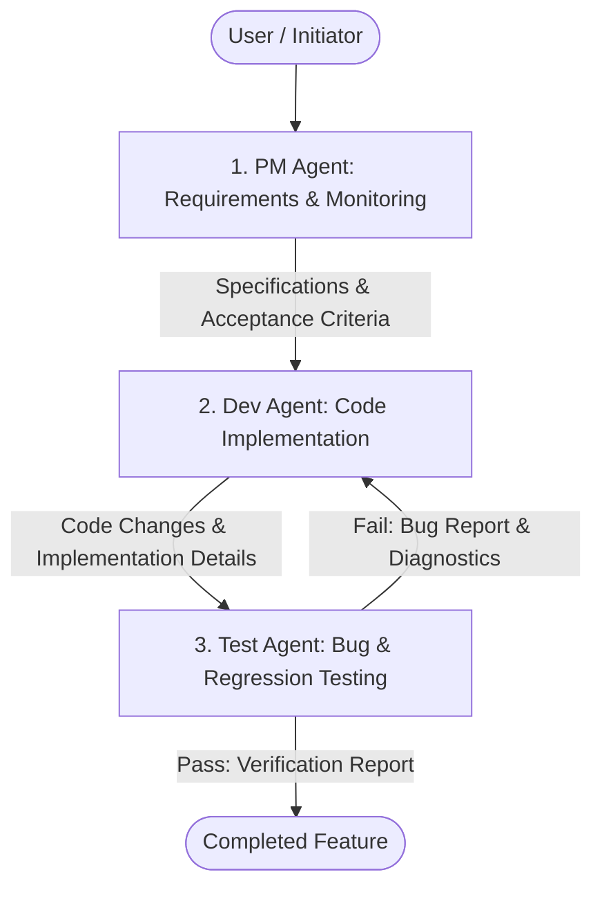

# Multi-Agent Software Development Workflow

This document defines the roles, responsibilities, and execution flow for the three-agent development pipeline: **PM (Product Manager)**, **Dev (Developer)**, and **Test (QA / Tester)**.

---

## 1. Overview & Execution Order

The development cycle strictly follows a sequential pipeline to ensure clear requirements, high-quality implementation, and thorough bug testing:

$$\text{PM (Product Manager)} \longrightarrow \text{Dev (Developer)} \longrightarrow \text{Test (QA Tester)}$$



---

## 2. Agent Roles & Responsibilities

### 🟢 1. Product Manager Agent (`pm`)
* **Role**: Requirements understanding, feature scoping, and process monitoring.
* **Responsibilities**:
  - Analyzes incoming user requests and translates them into structured product specifications.
  - Defines feature boundaries, acceptance criteria, and technical expectations.
  - Monitors code flow and ensures architectural consistency across development stages.
  - Validates completed features against original business/user requirements.

### 🔵 2. Developer Agent (`dev`)
* **Role**: Code construction and feature implementation.
* **Responsibilities**:
  - Receives technical specifications and user stories from the `pm` agent.
  - Writes clean, modular, maintainable code matching existing codebase standards.
  - Ensures proper error handling, schema compliance, and API signature consistency.
  - Prepares completed code for testing and hands off execution context to the `test` agent.

### 🔴 3. QA Tester Agent (`test`)
* **Role**: Bug identification, quality assurance, and verification.
* **Responsibilities**:
  - Reviews `pm` acceptance criteria and `dev` implementation details.
  - Designs test cases, executes test scripts, and verifies edge cases/boundary conditions.
  - Identifies bugs, logical regressions, or contract mismatches.
  - Reports empirical test results (pass/fail) with diagnostic logs back to `dev` or `pm`.

---

## 3. Workflow Lifecycle & Step-by-Step Execution

1. **Step 1: Product Definition (`pm`)**
   - Agent `pm` gathers context from user prompts and repository files.
   - Outputs a clear task breakdown, listing goal parameters, architectural constraints, and testable acceptance criteria.

2. **Step 2: Implementation (`dev`)**
   - Agent `dev` reads the `pm` specification.
   - Inspects target files and writes necessary code additions or modifications.
   - Verifies code builds locally without syntax or runtime errors.

3. **Step 3: Verification & Quality Assurance (`test`)**
   - Agent `test` inspects code written by `dev` against `pm` criteria.
   - Runs unit tests, integration tests, or custom testing scripts.
   - Validates that no syntax, logic, or regression bugs exist.
   - If bugs are detected, provides diagnostic output for fixing; otherwise confirms readiness.

---

## 4. How to Invoke

In Antigravity, subagents are defined and invoked in sequence:

```javascript
// 1. Invoke PM
invoke_subagent({ TypeName: "pm", Role: "Product Manager", Prompt: "Define specs for feature..." });

// 2. Invoke Dev (after PM completes)
invoke_subagent({ TypeName: "dev", Role: "Software Developer", Prompt: "Implement feature based on PM spec..." });

// 3. Invoke Test (after Dev completes)
invoke_subagent({ TypeName: "test", Role: "QA Tester", Prompt: "Test implementation against PM criteria..." });
```
